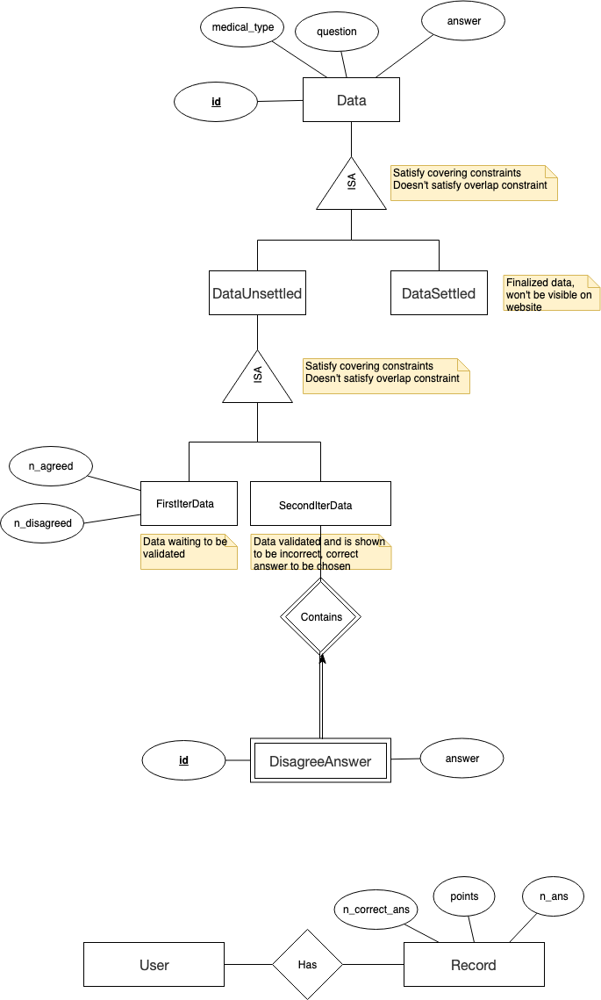

[TOC]

# Project Proposal

## Design

### Prototype

Refer to: https://www.fluidui.com/editor/live/preview/cF9UYUpPT0wxTU5WblY1TmlGcklPeFI2UU9PVGVacU0wTQ==

### Framework Used

**Django**

Advantages:

- Easy to pick up
- Can integrate with deep learning and machine learning more easily (same language)
- Security

[]: https://medium.com/crowdbotics/when-to-use-django-and-when-not-to-9f62f55f693b	"When to use Django"

Alternatives:

**Ruby on Rails**

- General purpose like Django
- Readable
- Hard to debug

### Design Considerations

#### Authentication

Django authentication system

Alternative:

> ##### Form-based authentication
>
> Form-based Authentication gives the developer freedom to build a more secure authentication scheme. This type evolved over time. Basically, form-based authentication refers to any mechanism that relies on factors external to the HTTP protocol for authenticating the user. The application is left to deal with taking the user credentials, verifying them and deciding their authenticity.
>
> The simplest way to do so is to have a login form that asks the user for the username and password. These values are then compared with the username and the password already present in the database. The password is protected during transmission by either using an SSL connection or encrypting the password. SSL protects the password during transmission but it can still be stolen by a local adversary from the browser's memory. This problem can be fixed by using a salted hash technique to transmit the password.
>
> ##### Advantages
>
> - The developer is free to implement the Login page in a desired manner.
> - All development frameworks and languages support form authentication.
>
> ##### Disadvantages
>
> - Encryption or security is not enforced by default. The responsibility to implement a safe solution belongs to the developer.
>
> References:
>
> [Evolution of Authentication in Web Applications]: https://www.paladion.net/blogs/evolution-of-authentication-in-web-applications	"Evolution of Authentication in Web Applications"

#### Data Update Logic

Pre-condition: Each data is sent to 3 different account for cleansing.

- \>= 2 out of 3 agreed
  - Reviewer +3 point for having made positive contribution, and +1 for having made attempt
  - Data is finalized.
- <= 1 out of 3 agreed
  - 2-3 updated answer was stored and published to controversial task list the day after
  - Another 5 out of **other** accounts are to be assigned to check which answer is more suitable
    - If there are 1,2,4 other accounts, assign the question to any one left
    - If there are 0 or 3 other accounts, admin needs to manually update it
  - For the selected answer, reviewer +3 point, other reviewers +2 having made positive contribution, and +1 for having made attempt

##### Possible Extension:

Make the number of checker for each record customizable. However, this will influnece the examination for new answers. Therefore, this extension may only be activated when the task is only verifying data without updating and modifying.

#### Task Assign Logic

Each user should get two types of tasks per day: 1st Iteration Data Cleansing (New Tasks) and 2nd Interation Data Cleansing (Controversial Tasks)

The table that data should be retrieved from is different, while the logic to allocate them to each user is the same

No. of tasks assigned to per user daily = Math.min(PREDEFINED_MAX, floor(No. of all **unchecked** tasks in db / No. of all doctors))

> NOTE: `tasks` is data under each iteration, i.e. the number of data (tasks) received per day is computed separately

##### Possible Extension:

No. of all doctors is referring to active doctors. For now all doctor accounts registered are assumed to be active. Extension is admin being able to control the state of doctor account.

#### Database

##### Schema

##### Reason to split data settled:

1. Easier to get all the finalized data

2. Finalized data set is assumed to be large. Split finalized data can improve the efficiency to get data to be cleaned.

##### Reason to split unsettled data:

Different attributes is needed for each iteration.

### Possible Problems

#### Race condition

## Use cases

#### Log In

MSS

1. User requests to log in
2. User inputs account and password
3. App checks validity of user's input
4. User logs in successfully

Extensions

3a. The input is in invalid format

​	3a1. Error message shown on the screen.

3b. The input account and password don't match each other

​	3b1. Error message shown on the screen.

4a. The user account is admin account

​	4a1. User is directed to admin page

4b. The user account is admin account

​	4b1. User is directed to user page

#### Sign Up

Pre-conditions:

User must log in to an admin account

MSS

1. User requests to sign up a new **user** account
2. User input necessary information into the respective fields.
3. App checks the validity of input information.
4. App register the account and update the number of data record assigned to each account.
5. Account signed up successfully.

Extensions

3a. The input is in invalid format

​	3a1. Error message shown on the screen.

4a. Network failed when registering

​	4a1. Cancel and revert any operations done.

​	4a2. Error message shown on the screen.

#### Change Password

Pre-conditions:

User logged in

MSS:

1. User requests to change password
2. User input new password can confirm password
3. User click confirm to update password
4. App update the password

Extensions:

2a. Passwords don't match

​	2a1. Error message is shown on the screen.

​	2a2. Use case ended.

#### Forgot Password

MSS:

1. User requests to get password.
2. User input the email of his/her profile and ID.
3. App send change-password link to the email.
4. User input new password can confirm password
5. User click confirm to update password
6. App update the password

Extensions:

2a. Information is incorrect

​	2a1. Error message is shown on the screen.

​	2a2. Use case ended.

#### Attempt Data Cleansing

Pre-conditions:

User must log in to a user account

MSS

1. User requests to do data cleaning
2. App allocates today's tasks to the account
3. App shows the data list to user
4. User clicks on each of the data records to confirm/edit it
5. App detects and logs user action `issue: simultaneously`
6. App updates the database accordingly

#### Update Data Manually

Pre-conditions:

User must log in to an admin account

MSS:

1. Admin request to do data update
2. Admin edit the answer or confirm the original answer
3. Admin confirm the update
4. App update the data and change its state to checked
5. App log the action

#### Generate Report

Pre-conditions:

User must log in to an admin account

MSS:

1. Admin choose report period
2. Admin requests to generate the report of user's contribution
3. App check the log information and compute each user's contribution according to the correctness and number of tasks done
4. App output the result

#### Export Report

Pre-conditions:

User must log in to an admin account

User is in report page and has generated report already

MSS:

1. Admin requests to export the report
2. App generates excel file and downloads it to local computer

